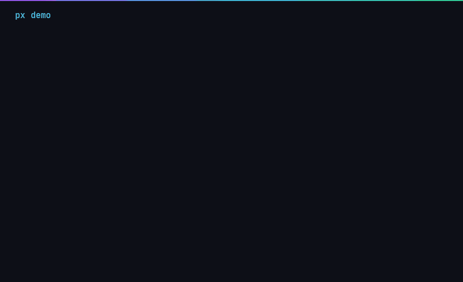

<div align="center">

# px

**the universal package-manager front-end**

*one command, every ecosystem, any distro*

[](https://github.com/samuelgirmametaferia/px/actions/workflows/ci.yml)
[](https://github.com/samuelgirmametaferia/px/actions/workflows/registry-build.yml)
[](https://github.com/samuelgirmametaferia/px/tags)

</div>

---



`px install <package>` searches configured sources, uses project identity
where available, ranks installation methods, and calls the matching
package manager. Whether it lives in your distro's repos, the AUR, on crates.io,
npm, PyPI, a GitHub release, or behind an official `install.sh`, one
command handles it.

```text
$ px install agent-code

  ✓ resolved agent-code → avala-ai/agent-code
    identity: px upstream registry (confidence 100, validated)

    › installation methods:
    1. cargo install agent-code [confidence 100] registry method 0
    2. installer (…/install.sh) [confidence 100] installer hash pinned

    → installing via cargo install agent-code
    ✔ binary: agent (/home/you/.local/bin/agent)
    ✔ installed via cargo install agent-code

    ▶ the command is agent — not agent-code
```

## Install

**Build from source** (Linux; Rust toolchain required):

```sh
git clone https://github.com/samuelgirmametaferia/px
cd px
cargo install --path . --bin px
```

**Prebuilt binaries:** choose a product version (`v…`) on the
[releases page](https://github.com/samuelgirmametaferia/px/releases).
Registry releases contain package metadata, not the px executable.
The v3.1.0 binary is Linux x86_64 only; ARM users should build from source.

## Try it

```sh
px doctor                         # see detected tools and distro
px --dry-run install ripgrep       # preview an installation
px search ffmpeg                   # compare available sources
px install ripgrep                 # install through your package manager
px path ripgrep                    # find its executable
px remove ripgrep                  # remove it again
```

For a project checkout, use `px install for ./my-project`. Run
`px --tutorial` for an interactive introduction. px uses per-user state;
run it as your normal user and let it request sudo when needed.

Bundled distro recipes cover Arch, Debian/Ubuntu, Fedora, and openSUSE.
Package availability depends on the configured sources and upstream projects.

## What it does

| | |
|---|---|
| **universal install** | `px install neovim agent-code http-server` — repos, AUR, cargo, npm, pipx, go, gem, brew, release binaries, install scripts |
| **project analysis** | `px install for ./my-project` (or `px -i -> ./my-project`) — reads imports/includes/scripts, installs the system packages it needs |
| **search everything** | `px search ffmpeg` — every source at once, fuzzy-ranked, with descriptions |
| **remove anything** | `px remove agent-code` — routed to whichever method installed it; package ≠ binary handled (`agent-code` installed `agent`) |
| **clean up** | `px suggest` — orphans and space hogs, with sizes |
| **upgrade** | `px upgrade` — your distro's own upgrade (`pacman -Syu` / `apt upgrade` / …) |
| **discovery feed** | `px candidates` — repos the auto-discovery system has found |

## How resolution works

px resolves **project identity**, not package names:

```text
query → curated registry → upstream registry → crates.io (repo-linked)
      → GitHub (name-matched) → npm (repo-linked only)
```

A matching name in a registry proves nothing — npm's `agent-code` (no
repository, no versions) is not avala-ai's `agent-code`. npm same-name
packages without a repository link cap at confidence 20 and are **never**
installed silently. Methods are ranked:

```text
native package > verified release binary > cargo/npm/pipx/go/gem
              > brew > verified install script > source build
```

A failed method announces why and falls back to the next (installer 503 →
cargo). Security stops — a pinned installer hash that no longer matches,
a dangerous script scan — never fall through.

## The upstream registry

Software that isn't in any package manager is indexed in px's own
registry: BLAKE3-keyed, 4096-shard, CBOR/zstd, verified at 1,000,000
apps (~16ms warm lookups). Every record pins the exact installer sha256
it was validated with — if the live installer serves different bytes, px
**stops the install**. Discovery runs on GitHub Actions every 6 hours:
scanning for documented installers, validating candidates in a sandbox
(`px candidates` shows what it found), growing from real px usage via
scrubbed, hashed unresolved-query reports. Dead records stay as
tombstones so a hijacked name can't take over resolution.

## Safety

- px never runs as root; it elevates individual commands via sudo (asked
  before any drawing starts — a prompt behind a spinner is what hangs
  look like)
- npm install scripts, `curl | sh` installers, and source builds run in a
  **bubblewrap sandbox** — your system read-only, isolated namespaces
- installers are statically scanned first (obfuscation, rc/cron/sudoers
  writes, base64-into-shell, `rm -rf /` = refused)
- every query has a hard timeout; Ctrl+C exits clean; package-manager
  noise is captured, shown only on failure (`-v` for raw output)
- package-manager arguments are passed directly to child processes; shell
  installers are handled separately by the installer checks

## Any distro

px drives your distro's **own** tools, defined as data in recipes
(`recipes/*.toml`) — Arch, Debian/Ubuntu, Fedora, openSUSE ship today;
a new distro is a TOML file. `--recipe recipes/debian.toml --dry-run
install ffmpeg` prints the exact apt command from any machine.

## More

`px doctor` · `px status` · `px list` · `px completions <shell>` ·
`px cache clean` · `--dry-run` · `--bar rainbow` · `--sandbox/--no-sandbox`

Architecture deep-dive: [docs/registry.md](docs/registry.md) ·
Manual test checklist: [docs/manual-tests.md](docs/manual-tests.md)

[Contributing](CONTRIBUTING.md) · [Report a bug](https://github.com/samuelgirmametaferia/px/issues/new?template=bug_report.yml)

MIT license (declared in Cargo.toml).
